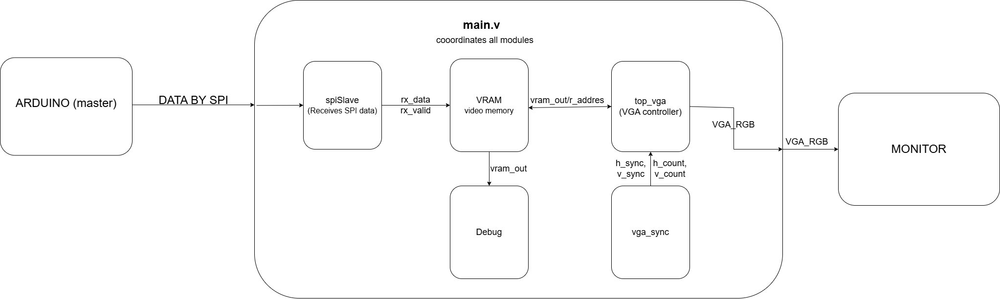
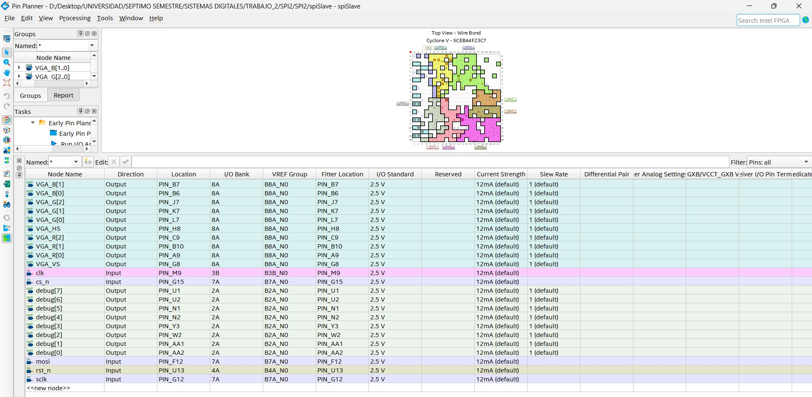

# VIDEO_ARDUINO-M-_FPGA-S-
This repository contains a method to use an Arduino as a master and a FPGA as a slave in order to transmit video by a VGA port to a monitor by SPI protocol.
This project is made up by six files: arduino.ino, spiSlave.v, vram.v, main.v, vga_sync.v and top_vga.v, which can be found in this repository. For better understanding the flow diagram of this project is shown below. 



The following is the explanation of each file, starting with the file that sends the data from the arduino and ending with the one that transmit the data to the monitor. 

---
## arduino.ino
This file allows the sending of data from the arduino (master) to the FPGA (slave) using SPI comunication. 

### Header and Definitions
```cpp
#include <SPI.h>

#define SS_PIN 10       // Slave Select pin
#define WIDTH 640      // Screen width (unused in this code)
#define HEIGHT 480     // Screen height (unused in this code)
#define SQUARE_SIZE 32  // Chessboard square size (unused in this code)
```
The SPI.h library provides functions for SPI communication.

**Pin Definitions:**

**SS_PIN (Pin 10):** Slave Select pin used to enable/disable the slave device

**Other definitions** (WIDTH, HEIGHT, SQUARE_SIZE) are declared but not used in this code
#### Setup
```cpp
void setup() {
  // Initialize SPI as master
  SPI.begin();
  
  // Configure SS pin
  pinMode(SS_PIN, OUTPUT);
  digitalWrite(SS_PIN, HIGH);
// Configure SPI speed and mode
  SPI.beginTransaction(SPISettings(8000000, MSBFIRST, SPI_MODE0));
// Select slave
  digitalWrite(SS_PIN, LOW);

  for (int i = 0; i < 1200; i++) {
    SPI.transfer(random());
  }

  // Deselect slave
  digitalWrite(SS_PIN, HIGH);
}
```
SPI.begin(): Initializes the SPI bus and sets the Arduino as master

**SS pin configuration:** Set as output (required for master).Set HIGH initially to deselect the slave

**SPISettings**: Clock speed (8 MHz),bit order (MSBFIRST), SPI_MODE0 (Clock polarity 0, phase 0). clock polarity 0 means that SPI clock (SCLK) is low (0) when idle, and phase 0 means that the data is sampled on the rising edge of the clock
**Slave selection:**  Set SS_PIN LOW to activate slave

**Data transfer:** Sends 1200 bytes using SPI.transfer() where each byte corresponds to each pixel of the display. A matrix is used to transfer the data of each byte, to obtain this matrix, a python file was developed.

**Data collection:** The file `image_to_spi_array.py` can obtain the 332RGB coded equivalent of each pixel in an image, and can also organize that information in the form of a matrix in order to transfer the data by means of SPI.transfer(). This file receives the path of an image as input and returns a 40x30 matrix with the RGB value of each pixel in hexadecimal.

**Slave deselection:** Set SS_PIN HIGH when communication is complete

---

### spi.Slave.v
This Verilog module implements an SPI slave device (FPGA in this case) compatible with SPI Mode 0 (CPOL=0, CPHA=0). It receives data from an SPI master (Arduino) and provides the received data to the FPGA system.

#### Module Interface

```verilog
module spiSlave (
    input wire clk,           // FPGA system clock
    input wire rst_n,         // Active low reset
    input wire sclk,          // SPI clock from Arduino
    input wire cs_n,          // Chip select (active low)
    input wire mosi,          // Master out, slave in
    output reg miso,          // Master in, slave out
    output reg [7:0] rx_data, // Received data
    output reg rx_valid       // Received data valid flag
);
```
**Port Descriptions:**

* clk: Main FPGA system clock

* rst_n: Active-low reset signal

* sclk: SPI clock from master device

* cs_n: Chip select (active low) from master

* mosi: Master Out Slave In data line

* miso: Master In Slave Out data line (note: not fully implemented in this code)

* rx_data: 8-bit received data register

* rx_valid: Flag indicating when new data is available in rx_data

It is important to note that the SCLK and CLK clocks are different, the former is associated with SPI communication, while the latter is the internal clock of the FPGA (50 MHz). In order to avoid instabilities, it is crucial that a clock synchronization process is performed so that the SPI clock enters the FPGA clock domain. The following is the explanation of the synchronization process.

```verilog
// Synchronization registers
reg [2:0] sclk_sync;
reg [1:0] cs_n_sync;
reg [1:0] mosi_sync;

// Edge detection
wire sclk_rising;
wire sclk_falling;

// SPI state tracking
reg [2:0] bit_count;
reg [7:0] rx_shift;
```

as can be seen, there is a 3-stage synchronizer for sclk (SPI clock) and 2-stage synchronizers for cs_n and mosi. but, Why 3-stage for sclk but 2-stage for others? sclk is critical because it determines when data is sampled. A 3-stage synchronizer reduces the chance of instability glitches. other signals are not critical for timing, so 2 stages are sufficient 

```verilog
// Synchronize inputs to FPGA clock domain
always @(posedge clk or negedge rst_n) begin	
	if (!rst_n) begin
		sclk_sync <= 3'b000;
		cs_n_sync <= 2'b11;
		mosi_sync <= 2'b00;
	end else begin
		sclk_sync <= {sclk_sync[1:0], sclk};
		cs_n_sync <= {cs_n_sync[0], cs_n};
		mosi_sync <= {mosi_sync[0], mosi};
	end
end
	
```
Each time a reset signal is detected, the system will return to its default values, on the other hand, with each rising edge of the CLK clock, the bit of its current value will be concatenated in sclk_sync with the two immediately preceding bits. The following table best illustrates this configuration

| (`clk`) time| `sclk` (input) | `sclk_sync` (before) | operation               | `sclk_sync` (after) |                      |
|----------------|------------------|---------------------|-------------------------|-----------------------|--------------------------------|
| t=1            | 1                | `000`               | `{00,1}` → `001`        | `001`                 | first input bit           |
| t=2            | 0                | `001`               | `{01,0}` → `010`        | `010`                 | change to 0                     |
| t=3            | 1                | `010`               | `{10,1}` → `101`        | `101`                 | New high pulse               |
| t=4            | 1                | `101`               | `{01,1}` → `011`        | `011`                 | remains in high state                     |
| t=5            | 0                | `011`               | `{11,0}` → `110`        | `110`                 | down flank               |


All this is done in order that the following instruction detects edges when comparing bits as follows 

```verilog
// Edge detection logic
assign sclk_rising = (sclk_sync[2:1] == 2'b01);
assign sclk_falling = (sclk_sync[2:1] == 2'b10);
```
If the two oldest bits of sclk_sync correspond to 01 we are on a rising edge, so sclk_rising is set as high, while if the opposite is true and the two bits correspond to 10 sclk_falling is set as high. Now that system has been synchronised, we can continue with main logic as follows

```verilog
always @(posedge clk or negedge rst_n) begin
    if (!rst_n) begin
        // Reset all registers
        bit_count <= 3'b000;
        rx_shift <= 8'h00;
        rx_data <= 8'h00;
        rx_valid <= 1'b0;
    end else begin
        // Default assignment
        rx_valid <= 1'b0;
        
        // Only process when chip is selected
        if (!cs_n_sync[1]) begin
            // Sample on rising edge (SPI Mode 0)
            if (sclk_rising) begin
                // Shift in new bit (MSB first)
                rx_shift <= {rx_shift[6:0], mosi_sync[1]};
                
                // Check if complete byte received
                if (bit_count == 3'b111) begin
                    rx_data <= {rx_shift[6:0], mosi_sync[1]};
                    rx_valid <= 1'b1;
                    bit_count <= 3'b000;
                end else begin
                    bit_count <= bit_count + 1;
                end
            end
        end
    end
end
```
If a reset signal is detected all values are set as default. Next, the line rx_valid <= 1'b0; ensures the valid pulse only lasts one clock cycle. Then, the instruction if (!cs_n_sync[1]) begin ensures that the logic only activates when chip select is low (slave is selected). Finally, if a risign edge is detected (if (sclk_rising) begin) the main operation is started. Note that all this instructions uses the synchronised version of variables.

The data shifting operation rx_shift <= {rx_shift[6:0], mosi_sync[1]}; performs a left shift that takes the current 7 most significant bits of rx_shift (bits [6:0]) and appends the newly received bit from mosi_sync[1] at the least significant bit (LSB) position, implementing MSB-first (most significant bit first) reception which is the SPI standard convention. This approach gradually builds the complete byte by shifting each new received bit into the left side of the register while inserting the incoming bit at the rightmost position, effectively assembling the data stream one bit at a time with the first received bit ending up as the highest-order bit in the final byte. The operation occurs on every rising edge of the synchronized SPI clock when the slave is selected, maintaining proper bit order and timing according to the SPI protocol specifications.
Finally, checks if all 8 bits have been received (count = 7) when it is true captures full byte: rx_data <= {rx_shift[6:0], mosi_sync[1]}, and then combines previous 7 bits + new 8th bit. set rx_valid as high for one clock cycle and resets bit_count to 0

For better understanding, time diagram is presented
# SPI Slave Timing Diagram (Mode 0 - CPOL=0, CPHA=0)

| clk | !rst_n | cs_n_sync[1] | sclk_sync[1] | mosi_sync[1] | bit_count | rx_shift (bin) | rx_data (hex) | rx_valid | Event Description               |
|-----|--------|--------------|--------------|--------------|-----------|----------------|---------------|----------|---------------------------------|
| ↑   | 1      | 1            | 0            | X            | 0         | 00000000       | XX            | 0        | Idle (chip not selected)        |
| ↑   | 1      | 0            | 0            | 1            | 0         | 00000000       | XX            | 0        | Chip selected (start of frame)  |
| ↑   | 1      | 0            | ↑ (0→1)      | 1            | 0         | 00000001       | XX            | 0        | 1st rising edge - bit 0 (MSB)   |
| ↑   | 1      | 0            | ↑ (0→1)      | 0            | 1         | 00000010       | XX            | 0        | 2nd rising edge - bit 1         |
| ↑   | 1      | 0            | ↑ (0→1)      | 1            | 2         | 00000101       | XX            | 0        | 3rd rising edge - bit 2         |
| ↑   | 1      | 0            | ↑ (0→1)      | 0            | 3         | 00001010       | XX            | 0        | 4th rising edge - bit 3         |
| ↑   | 1      | 0            | ↑ (0→1)      | 1            | 4         | 00010101       | XX            | 0        | 5th rising edge - bit 4         |
| ↑   | 1      | 0            | ↑ (0→1)      | 0            | 5         | 00101010       | XX            | 0        | 6th rising edge - bit 5         |
| ↑   | 1      | 0            | ↑ (0→1)      | 1            | 6         | 01010101       | XX            | 0        | 7th rising edge - bit 6         |
| ↑   | 1      | 0            | ↑ (0→1)      | 0            | 7         | 10101010       | XX            | 0        | 8th rising edge - bit 7 (LSB)   |
| ↑   | 1      | 0            | 1            | X            | 0         | 01010100       | AA            | 1        | Byte complete (rx_valid pulse)  |
| ↑   | 1      | 1            | X            | X            | 0         | 01010100       | AA            | 0        | Chip deselected                 |
---
Now, once the data have been well received, it is time to pass to the processing of it.

---
## vram.v
This Verilog module implements a double-buffered Video RAM (VRAM) controller designed for display systems. 

```verilog
module vram#(
    parameter ADDR_WIDTH = 11,   // 1KB memory
    parameter DATA_WIDTH = 8    // Byte-wide data
)
(
input wire clk,
input wire rx_valid,
input wire [DATA_WIDTH - 1: 0] data_in,
output reg ready_flag, // Indicates vram is ready to be read from
input wire read_en, // Vram data reading enable
output reg [DATA_WIDTH - 1: 0] data_out,
input wire rst_n,
input [ADDR_WIDTH - 1 : 0] read_addr
); 
	
	parameter x_size = 40;
	parameter y_size = 30;
	
	parameter addr_size = x_size * y_size;
	
	reg rx_valid_prev;
	wire rx_rising;
	
	reg [DATA_WIDTH - 1 : 0] buffer [0 : addr_size - 1];
	reg [DATA_WIDTH - 1 : 0] ram [0 : addr_size - 1];
	
	reg [ADDR_WIDTH : 0] write_ptr;
	
	reg full_flag; // Indicates buffer is full 
```

### Module Parameters

| Parameter     | Default | Description |
|--------------|---------|-------------|
| `ADDR_WIDTH` | 11      | Determines addressable space (2^11 = 2048 bytes) |
| `DATA_WIDTH` | 8       | Data bus width (8-bit bytes) |
| `x_size`     | 40      | Display width in pixels |
| `y_size`     | 30      | Display height in pixels |
| `addr_size`  | 1200    | Calculated total pixels (x_size * y_size) |

### Port Description

| Port          | Direction | Width   | Description |
|---------------|-----------|---------|-------------|
| `clk`         | input     | 1       | System clock |
| `rx_valid`    | input     | 1       | Data valid strobe |
| `data_in`     | input     | [7:0]   | Input pixel data |
| `ready_flag`  | output    | 1       | VRAM ready for reading |
| `read_en`     | input     | 1       | Read enable signal |
| `data_out`    | output    | [7:0]   | Output pixel data |
| `rst_n`       | input     | 1       | Active-low reset |
| `read_addr`   | input     | [10:0]  | Read address |

### Internal Signals

| Signal         | Type     | Description |
|----------------|----------|-------------|
| `rx_valid_prev`| reg      | Previous value of rx_valid for edge detection |
| `rx_rising`    | wire     | Rising edge detect on rx_valid |
| `buffer`       | reg [ ]  | Input buffer memory |
| `ram`          | reg [ ]  | Main display memory |
| `write_ptr`    | reg      | Dual-purpose write pointer |
| `full_flag`    | reg      | Buffer full indicator |


```verilog
//main logic
always @(posedge clk) begin
		if (!rst_n)
			rx_valid_prev <= 1'b0;
		else
			rx_valid_prev <= rx_valid;
	end
	
	assign rx_rising = rx_valid == 1'b1 && rx_valid_prev == 1'b0;
	
	// Vram management logic
	always @(posedge clk) begin
		if (!rst_n) begin
			write_ptr <= 0;
			full_flag <= 0;
			data_out <= 0;
			ready_flag <= 0;
		end else begin
			// Buffer logic
			if (rx_rising && !full_flag) begin
				buffer[write_ptr] <= data_in;
		
				if (write_ptr == addr_size - 1) begin
					full_flag <= 1'b1;
					write_ptr <= 0; // Will be reused as pointer for vram data writing
				end else
					write_ptr <= write_ptr + 1;
			end
			
			// Vram writing logic
			if (full_flag && !ready_flag) begin
				ram[write_ptr] <= buffer[write_ptr];
				
				if (write_ptr == addr_size - 1)
					ready_flag <= 1'b1;
				else
					write_ptr <= write_ptr + 1;
			end
			
			// Vram reading logic
			if (ready_flag && read_en) begin
				data_out <= ram[read_addr];
			end
		end
	end
	
endmodule
```
**Signal Declarations and Edge Detection:**
The code implements a rising-edge detector for the rx_valid signal using a synchronous flip-flop (rx_valid_prev) and combinatorial logic (rx_rising). This creates a one-clock-cycle pulse when new valid data arrives, crucial for properly timing write operations. The design uses two separate memory arrays: 'buffer' acts as temporary storage for incoming pixels, while 'ram' serves as the stable video memory for display output. The write_ptr register serves dual purposes - tracking buffer writes initially, then switching to RAM writes during buffer transfers.

**Reset Logic:**
The synchronous reset block (triggered by rst_n) initializes all control signals: write_ptr resets to zero, flags (full_flag and ready_flag) clear to indicate empty state, and data_out zeros to prevent undefined outputs. This ensures deterministic startup behavior when the system initializes or recovers from errors.

**Buffer Write Logic:**
During normal operation, each detected rx_rising edge triggers a buffer write at the current write_ptr location. The design automatically increments the pointer and monitors for buffer fullness (when write_ptr reaches addr_size-1). At full capacity, it sets full_flag and resets write_ptr - this flag transition initiates the critical buffer-to-RAM transfer phase while preventing new buffer writes during transfer.

**Memory Transfer Mechanism:**
When full_flag activates, the same write_ptr now indexes both buffer (read side) and ram (write side) in a sequential copy operation. This atomic transfer ensures frame coherency - either a complete frame transfers or none at all. Upon completing the full transfer (write_ptr wraps again), ready_flag asserts, signaling display logic that fresh frame data is available for reading.

**Read Interface Operation:**
The output stage operates when ready_flag is high, using a simple synchronous read: when read_en asserts, the addressed ram content immediately appears on data_out. This single-cycle latency enables real-time pixel streaming for display controllers. The separation of read_addr from write operations eliminates contention and ensures stable output during frame updates.

Now, once that the reading and writing (vram) process is done, it is time to focus on the VGA configuration

## vga_sync
This Verilog module generates the synchronization signals (hsync and vsync) and timing counters (hcount and vcount) needed to drive a standard 640x480@60Hz VGA display. The following is the breakdown of the code

```verilog
//module declaration
module vga_sync (
    input  wire       clk_25MHz,    // 25 MHz clock input
    input  wire       reset,        // Active-high asynchronous reset
    output reg        hsync,        // Horizontal sync pulse
    output reg        vsync,        // Vertical sync pulse
    output wire       video_enable, // Active during visible area
    output reg [9:0]  hcount,       // Horizontal pixel counter (0-799)
    output reg [9:0]  vcount        // Vertical line counter (0-524)
);
```

**Inputs**

**clk_25MHz:** Standard frequency for 640x480@60Hz timing

**reset:** Resets all counters when high

**Outputs:** Synchronization signals (hsync, vsync), counters (hcount, vcount), video_enable 

```verilog
//Timing parameters
// Horizontal timing (in pixels)
localparam H_VISIBLE_AREA = 640;
localparam H_FRONT_PORCH  = 16;
localparam H_SYNC_PULSE   = 96;
localparam H_BACK_PORCH   = 48;
localparam H_TOTAL        = 800; // Sum of all above

// Vertical timing (in lines)
localparam V_VISIBLE_AREA = 480;
localparam V_FRONT_PORCH  = 10;
localparam V_SYNC_PULSE   = 2;
localparam V_BACK_PORCH   = 33;
localparam V_TOTAL        = 525; // Sum of all above
```
**Horizontal Timing:**

* **Visible area:** 640 pixels

* **Front porch:** 16 pixels (after visible area, before sync)

* **Sync pulse:** 96 pixels (horizontal retrace)

* **Back porch:** 48 pixels (after sync, before next line)

**Vertical Timing:**

* **Visible area:** 480 lines

* **Front porch:** 10 lines (after frame, before vsync)

* **Sync pulse:** 2 lines (vertical retrace)

* **Back porch:** 33 lines (after vsync, before next frame)

```verilog

//counter logic
always @(posedge clk_25MHz or posedge reset) begin
    if (reset) begin
        hcount <= 0;
        vcount <= 0;
    end else begin
        if (hcount == H_TOTAL - 1) begin
            hcount <= 0;
            if (vcount == V_TOTAL - 1)
                vcount <= 0;
            else
                vcount <= vcount + 1;
        end else begin
            hcount <= hcount + 1;
        end
    end
end
```
The counter logic in this VGA sync module uses two 10-bit registers (hcount and vcount) to track the current horizontal pixel position and vertical line position, respectively, within each video frame. On every rising edge of the 25 MHz clock (or when reset is asserted), the horizontal counter increments until it reaches the end of a line (799 pixels), at which point it resets to 0 and the vertical counter either increments (for a new scanline) or resets to 0 (when reaching the bottom of the frame at line 524). This dual-counter system creates a precise coordinate system that progresses left-to-right and top-to-bottom across the screen, with the horizontal counter advancing every pixel clock and the vertical counter advancing only at the end of each complete line, perfectly synchronizing with the VGA timing requirements for 640x480 resolution at 60Hz refresh rate.

```verilog
//sync logic and video enable signal
always @* begin
    if (hcount >= (H_VISIBLE_AREA + H_FRONT_PORCH) &&
        hcount < (H_VISIBLE_AREA + H_FRONT_PORCH + H_SYNC_PULSE))
        hsync = 0; // Active low pulse
    else
        hsync = 1;
end

always @* begin
    if (vcount >= (V_VISIBLE_AREA + V_FRONT_PORCH) &&
        vcount < (V_VISIBLE_AREA + V_FRONT_PORCH + V_SYNC_PULSE))
        vsync = 0; // Active low pulse
    else
        vsync = 1;
end

assign video_enable = (hcount < H_VISIBLE_AREA) && (vcount < V_VISIBLE_AREA);
```

The sync signal generation creates the critical timing pulses that synchronize the VGA monitor's electron beam with the digital video signal. The horizontal sync (hsync) pulses low for 96 pixels (from pixel 656 to 751) at the end of each scanline to signal the monitor to retrace horizontally, while the vertical sync (vsync) pulses low for 2 lines (from line 490 to 491) at the end of each frame to initiate vertical retrace. These active-low pulses are generated combinatorially by comparing the current hcount and vcount positions against predefined thresholds (visible area + front porch) to determine when to trigger the sync periods, ensuring proper alignment with the monitor's expected timing. The sync signals work in conjunction with the front and back porch periods (blanking intervals) to provide the monitor sufficient time to physically reposition the electron beam between lines and frames.

The video_enable signal is a combinational output that goes high only when the current pixel position (hcount and vcount) falls within the visible screen area (0 ≤ hcount < 640 and 0 ≤ vcount < 480). It acts as a gate to indicate when pixel data should be displayed. The simple AND operation (hcount < 640) && (vcount < 480) ensures the signal updates immediately as counters change, without clock delays

To summarize, vga_sync allows the synchronization of signal generation for VGA timing. That is the reason why it uses a 25 MHz clock instead of 50 MHz like the others. So, now let us focus on video configuration of VGA,.


## top_vga.c
This Verilog module implements a VGA controller that generates video signals for displaying graphics on a VGA monitor. It uses a PLL to generate a 25 MHz clock from a 50 MHz input, synchronizes horizontal and vertical signals using a vga_sync module, and outputs RGB color data by reading from an external memory (addressed by divided horizontal and vertical counters). The following is the breakdown of the code

```verilog
//Module Declaration & Parameters
module top_vga (
    input  wire        CLOCK_50,  // 50 MHz clock from DE0-CV
    input  wire        RESET_n,   // Active-low reset button
    output wire        VGA_HS,    // Hsync to monitor
    output wire        VGA_VS,    // Vsync to monitor
    output wire [2:0]  VGA_R,     // 3 red bits
    output wire [2:0]  VGA_G,     // 3 green bits
    output wire [1:0]  VGA_B,     // 2 blue bits
    output reg [(ADDR_WIDTH - 1) :0] r_address,
    input [7:0] DATA
);

parameter ADDR_WIDTH = 11;
parameter DIVISION = 16;
```
The module top_vga defines the input/output interface, including the 50 MHz clock (CLOCK_50), active-low reset (RESET_n), VGA sync signals (VGA_HS, VGA_VS), and RGB color outputs (VGA_R, VGA_G, VGA_B). It also includes an address output (r_address) to read pixel data from an external memory (DATA input). The ADDR_WIDTH parameter sets the memory address width (11 bits), while DIVISION (16) scales down the resolution for memory addressing.
```verilog
//PLL for Clock Generation
//---------------------------------------------------------------------
// 1) Internal signals for PLL and VGA logic
//---------------------------------------------------------------------
wire clk_25MHz;    // 25 MHz clock generated by PLL
wire locked_pll;   // Indicates PLL is stabilized

//---------------------------------------------------------------------
// 2) PLL instance (generated by Quartus IP)
//    File named "prueba_0002.v"
//    Module name "prueba_0002"
//---------------------------------------------------------------------
pll pll_inst (
    .refclk   (CLOCK_50),     // Connect 50 MHz clock
    .rst      (~RESET_n),     // Active-low reset => inverted
    .outclk_0 (clk_25MHz),    // 25 MHz output
    .locked   (locked_pll)
);
```
The Phase-Locked Loop (PLL) instance (pll_inst) converts the 50 MHz input clock (CLOCK_50) into a stable 25 MHz pixel clock (clk_25MHz), which is required for standard VGA timing. The locked_pll signal ensures the PLL is stable before the VGA controller starts operating.

```verilog
//VGA Sync Generation
//---------------------------------------------------------------------
// 3) Signals for VGA synchronization
//---------------------------------------------------------------------
wire hsync_sig, vsync_sig;
wire video_enable;
wire [9:0] hcount, vcount;

//---------------------------------------------------------------------
// 4) Instantiate VGA synchronization module
//---------------------------------------------------------------------
vga_sync sync_unit (
    .clk_25MHz    (clk_25MHz),
    .reset        (~RESET_n),   // Could use (!locked_pll) for more control -> .reset (~RESET_n | ~locked_pll)
    .hsync        (hsync_sig),
    .vsync        (vsync_sig),
    .video_enable (video_enable),
    .hcount       (hcount),
    .vcount       (vcount)
);

// Connect hsync and vsync signals to top-level outputs
assign VGA_HS = hsync_sig;
assign VGA_VS = vsync_sig;
```
The vga_sync module generates horizontal (hsync_sig) and vertical (vsync_sig) synchronization signals, along with hcount and vcount (pixel counters) that track the current screen position. The video_enable signal indicates when the beam is in the active display region, preventing drawing during blanking intervals. The complete explanation of this logic can be found above, in vga_sync.v section.

```verilog
//Color data handling and output
//---------------------------------------------------------------------
// 5) Color generation logic
//---------------------------------------------------------------------
reg [2:0] color_r;
reg [2:0] color_g;
reg [2:0] color_b;

always @(posedge clk_25MHz) begin
    // While PLL is not locked, we could force black
    if (!locked_pll) begin
        color_r <= 3'b000;
        color_g <= 3'b000;
        color_b <= 3'b000;
    end
    // Outside visible area, paint black
    else if (!video_enable) begin
        color_r <= 3'b000;
        color_g <= 3'b000;
        color_b <= 3'b000;
    end
    // In visible area, generate a simple pattern. Example: half red / half blue
    else begin
        r_address <= (hcount / DIVISION) + (vcount / DIVISION) * (640 / DIVISION);
        
        color_r <= DATA[7:5];
        color_g <= DATA[4:2];
        color_b <= DATA[1:0];
    end
end
// Assign outputs
assign VGA_R = color_r;
assign VGA_G = color_g;
assign VGA_B = color_b;

endmodule
```
The always block updates the RGB outputs (color_r, color_g, color_b) based on the input DATA bus, which provides 8-bit color (3 red, 3 green, 2 blue bits). When outside the visible area or if the PLL is unstable, the outputs are forced to black. The module generates an address (r_address) to fetch pixel data from an external memory. Since VGA typically operates at 640x480 resolution but memory is limited, the horizontal (hcount) and vertical (vcount) pixel counters are divided by DIVISION (16) to reduce the effective resolution (scaling down to 40x30 in this case). The formula:
```verilog
r_address <= (hcount / DIVISION) + (vcount / DIVISION) * (640 / DIVISION);  
```
calculates a linear memory address, effectively mapping screen coordinates to a smaller memory buffer.

The final assign statements connect the internal color registers (color_r, color_g, color_b) to the VGA output pins (VGA_R, VGA_G, VGA_B), ensuring the correct color data is sent to the monitor during the active video period. The sync signals (VGA_HS, VGA_VS) are directly driven by the vga_sync module.

Finally is time to talk about the principal module, main.v, which combines all modules shown above to accomplish the objective of VGA transmission.

## main.v

This Verilog module integrates all Verilog files shown above: spiSlave.v, vram.v, vga_sync and top_vga in order to show on the monitor the data sent from the Arduino (master) 

```verilog
//Module declaration and parameters
module main
(
	input wire clk,           // FPGA system clock
   input wire rst_n,         // Active low reset
   input wire sclk,          // SPI clock from Arduino
   input wire cs_n,          // Chip select (active low)
   input wire mosi,           // Master out, slave in
	output VGA_HS,
	output VGA_VS,
	output [2:0] VGA_R,
	output [2:0] VGA_G,
	output [1:0] VGA_B,
	output [7:0] debug
);
parameter ADDR_WIDTH = 11;

wire miso;
wire [7:0] rx_data;
wire rx_valid;
wire vram_ready;
reg read_en;
wire [7:0] vram_out;
wire [(ADDR_WIDTH - 1) : 0] r_address;
```
The main module begins by defining its input and output ports. It receives the main system clock (clk), an active-low reset signal (rst_n), and standard SPI signals (sclk, cs_n, and mosi) from an external device like an Arduino. It outputs VGA synchronization signals (VGA_HS, VGA_VS) and color signals (VGA_R, VGA_G, VGA_B) to a display. Additionally, it provides an 8-bit debug output to monitor internal data, specifically what's read from the video memory (VRAM). These ports form the interface between the FPGA and external systems (Arduino, display, debugging tools).

The module sets a parameter ADDR_WIDTH = 11, which defines the width of the address bus used to access the VRAM, allowing 2048 memory locations. It also declares internal wires and registers to handle data communication between the submodules. For example, rx_data holds the byte received over SPI, rx_valid indicates when valid data is received, vram_out holds the pixel data read from memory, and r_address specifies which pixel to read. The read_en register is used to enable reading from the VRAM once the system is ready.

```verilog
spiSlave spiSlave_instance(.clk(clk), .rst_n(rst_n), .sclk(sclk), .cs_n(cs_n), .mosi(mosi), .miso(miso), .rx_data(rx_data), .rx_valid(rx_valid));
vram vram_instance(.clk(clk), .rx_valid(rx_valid), .data_in(rx_data), .ready_flag(vram_ready), .read_en(read_en), .data_out(vram_out), .rst_n(rst_n), .read_addr(r_address));
top_vga top_vga_instance(.CLOCK_50(clk), .RESET_n(rst_n), .DATA(vram_out), .VGA_HS(VGA_HS), .VGA_VS(VGA_VS), .VGA_R(VGA_R), .VGA_G(VGA_G), .VGA_B(VGA_B), .r_address(r_address));
```
The spiSlave module is instantiated and wired to receive SPI signals (sclk, cs_n, mosi) and deliver received data (rx_data) along with a validity signal (rx_valid). This module acts as a communication bridge, converting serial SPI data from the Arduino into parallel data the FPGA can use. It is synchronized to the system clock and reset using clk and rst_n.

The vram module stores the received data for display. It writes new data when rx_valid is high, and it allows data to be read when read_en is active and vram_ready indicates readiness. Data is stored at internal addresses and accessed via read_addr, which is provided by the VGA controller. The output data_out contains the pixel value read from memory, which is routed to the VGA driver for display.

The top_vga module handles the video generation logic, taking in the current pixel data (DATA) and producing the appropriate VGA output signals (VGA_HS, VGA_VS, VGA_R, VGA_G, VGA_B). It also generates the memory address (r_address) indicating which pixel data should be read from VRAM at any given time. This module converts the internal memory representation into visible output for a monitor. Synchronization of VGA signals is in charge of vga_sync.v

```verilog
//Debug and control logic for VRAM reading
assign debug = vram_out;

always @(posedge clk) begin
	if (!rst_n) 
		read_en <= 1'b0;
	
	// Start reading from vram
	if (vram_ready) begin
		read_en <= 1'b1;
	end
end

endmodule
```
The line assign debug = vram_out; connects the VRAM output directly to the debug port. This is useful for troubleshooting or monitoring the actual data being sent to the screen, especially during development. connect or no connect this port does not affect the operation of this project.

The final always block defines a simple control mechanism: when the system is reset (!rst_n), reading from VRAM is disabled (read_en = 0). Once vram_ready is asserted, the system enables reading from VRAM by setting read_en = 1. This ensures that the VGA display logic only starts fetching data when the VRAM is fully initialized and ready to be read, avoiding visual glitches or undefined behavior.


# Pins assignments and physical implementation
In this project an Arduino uno was used as Master and a FPGA DE0-CV as a slave. An image of pin planner is shown below



